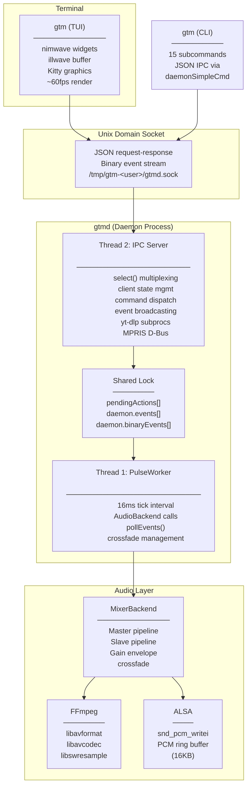
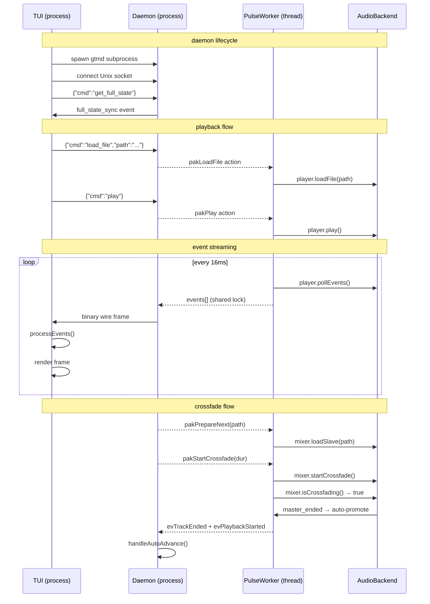
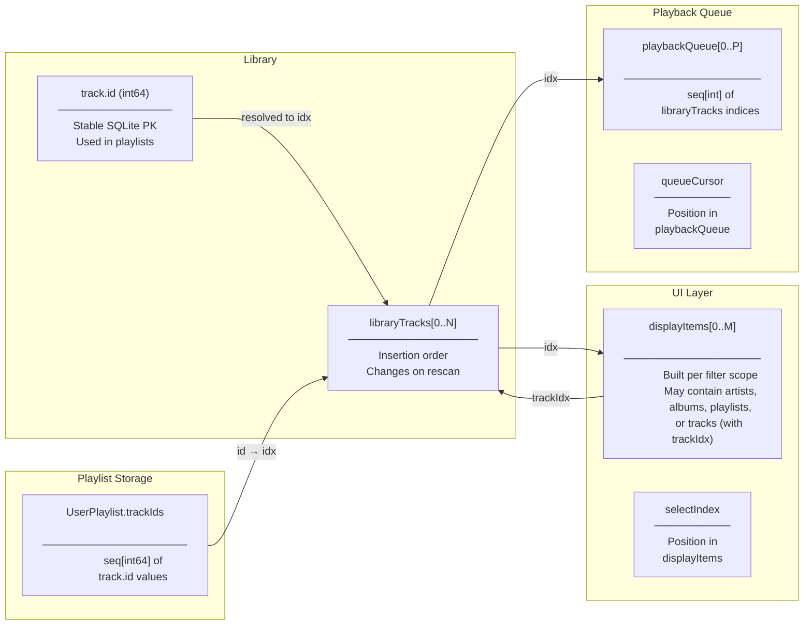
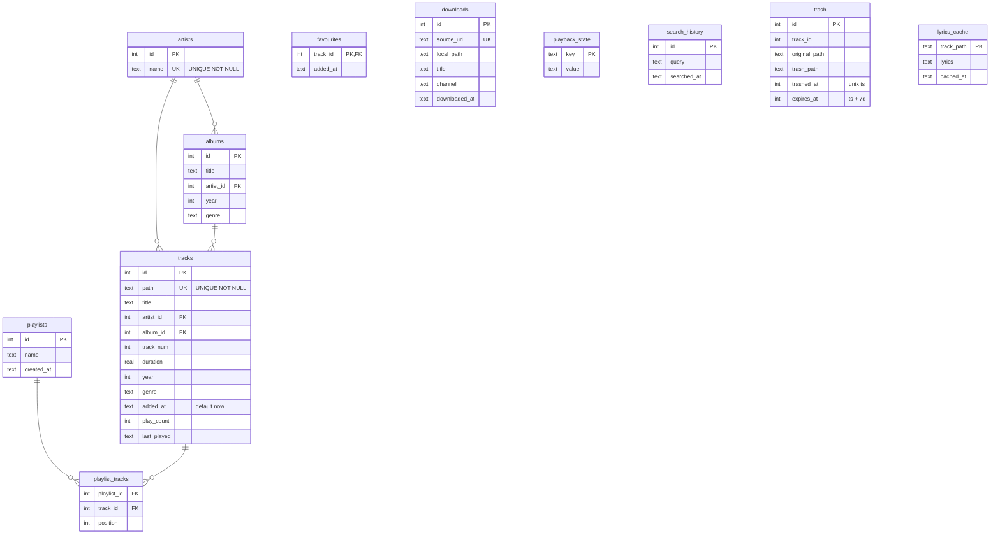

# gtm

A terminal-based music player with daemon architecture, SQLite library, dual-decoder crossfade, LRC lyrics, YouTube/Spotify integration, and MPRIS D-Bus remote control.

## Features

- **Daemon Architecture**: Background playback daemon with hot-reconnecting TUI client
- **Dual-Decoder Crossfade**: Hardware-mixed slave/master pipelines with configurable gain curves
- **Tabbed TUI**: Now Playing (album art + synced lyrics), Library (tracks/artists/albums), Settings
- **SQLite Library**: 10-table schema with artists, albums, playlists, favourites, trash, download history
- **LRC Lyrics**: Sidecar `.lrc` files + LRCLIB API search with timestamp sync
- **Kitty Album Art**: Terminal graphics protocol for embedded cover art + hover preview
- **Command Palette**: Fuzzy-search 49 commands with configurable keybindings
- **Vim-Style Select Mode**: Visual selection, batch operations, multi-track delete/add-to-playlist
- **YouTube Integration**: yt-dlp search, stream URL resolution, async downloads
- **Spotify OAuth**: Web API integration via OAuth, playlist import, liked-song sync
- **MPRIS 2.1**: D-Bus remote control for desktop environment integration
- **11 Themes**: Catppuccin (4), Gruvbox (2), Dracula, Tokyo Night (2), Ayu (2) — procedurally generated from any string seed
- **Dual Icon System**: Auto-detected Nerd Font with emoji fallback
- **JSON Config**: JSON Schema validated config with keybinding overrides and highlight customization
- **Shell Completions**: Fish, Zsh, Bash, Elvish, Nushell, Xonsh
- **CLI Remote Control**: 15 subcommands for daemon control from the shell

## Architecture

### Process Topology



### Thread Model



### Indexing Systems

The codebase manages five distinct index spaces across the library, UI, and queue:



## Core Subsystems

### Audio Pipeline

Two backends compiled into the binary via `vendor/ffmpeg/ffmpeg_impl.c` (1521 lines of C):

| Backend | Decode | Crossfade | EQ | Use Case |
|---------|--------|-----------|----|----------|
| `FfmpegBackend` | Single stream | None | None | Minimal/fallback |
| `MixerBackend` | Dual pipeline | Gain envelopes | 31-band | Default, preferred |

**Pipeline** (per stream): `avformat_open_input` → `avcodec_open2` → `swr_convert` → ALSA `snd_pcm_writei`

**Crossfade**: Slave decoder preloads next track via `pakPrepareNext` action. `pakStartCrossfade(duration)` applies configurable gain curves (EqualPower/Quadratic/Cubic/Asymmetric) over N frames. When `mixer.master_ended()` returns true, the slave auto-promotes to master — the PulseWorker emits `evTrackEnded` + `evPlaybackStarted` atomically.

### IPC Protocol

Communication over Unix domain socket (`SOCK_STREAM, AF_UNIX`) with two concurrent wire formats, selected per-client on connect:

**Binary wire** (`src/wire.nim` — compact, big-endian):
```
[0xFB magic] [4B total_len] [1B event_count] [event...]

Event encoding per kind:
  evPositionChanged (5):  [8B float64 time_pos]
  evVolumeChanged   (7):  [4B int32  volume]
  evPlaybackStarted (1):  [str path][str title][str channel][1B auto_adv][8B time][8B dur]
  evCustomEvent    (10):  [str name][1B kv_count][(str key, str val)...]
  (others):               no payload
```

**JSON wire** (version 1 — debuggable):
```json
{"events":[{"kind":5,"time_pos":123.4,"version":42}]}
```

All strings in binary: 2-byte uint16 length prefix (big-endian) + raw UTF-8.

### Library Schema (SQLite)

Database: `$XDG_DATA_HOME/gtm/gtm.db` — 10 tables in `initSchema()` (`src/library.nim:123-215`):



### TUI Rendering

Three-layer architecture:

| Layer | Library | Role | Lines |
|-------|---------|------|-------|
| Low-level | `vendor/illwave/illwave.nim` | Terminal buffer, key input, raw I/O | 1651 |
| Widget | `vendor/nimwave/nimwave.nim` | Context[T], Box/Scroll/Text nodes, layout | ~2000 |
| App | `src/ui.nim` | All 3 tabs, 14 overlays, footer, status | 2198 |

**Render loop** (`gtm.nim:2998`): 60fps capped via `epochTime` delta check (16ms). Blocks on `select()` with 16ms timeout for keyboard input. On each frame: drain daemon events → `processEvents()` → render dirty regions via nimwave's declarative tree.

**49 registered commands** dispatched through two tables:
- `keyDispatch`: `Table[iw.Key, seq[int]]` — single-key mappings
- `multiKeyDispatch`: `Table[seq[iw.Key], int]` — chord sequences (e.g., `g g` → go to first)

### Lyrics System

Three-tier resolution with LRU cache (`src/lyrics.nim:144`):

1. **Sidecar file**: `<trackname>.lrc` or `.txt` beside audio → `findLrcSidecar()`
2. **LRCLIB by params**: `GET https://lrclib.net/api/get?artist_name=...&track_name=...`
3. **LRCLIB search**: `GET https://lrclib.net/api/search?q=<title>` → fetch by ID

Parsing handles `[mm:ss.xx]`/`[hh:mm:ss.xx]` timestamps with `[ti:]`, `[ar:]`, `[al:]` metadata headers. Active line resolved via binary search on each `evPositionChanged`.

### Cover Art

Kitty terminal graphics protocol (`src/graphics.nim:64`):

1. `supportsKittyGraphics()` checks `TERM_PROGRAM` / `TERM`
2. `extractCoverArt()` in C calls FFmpeg's `avcodec_decode_...` for attached pictures
3. `transmitImage()` base64-encodes in 3584-byte chunks via `\e_G` APC sequences
4. LRU cache: `coverCache[hash(path)] = (data, mime)`, max 100 entries

### Icon System

`src/icons.nim` — 46-icon dual pack:

- **Nerd Font**: Unicode PUA codepoints (e.g., `\uF04B` play, `\uF028` volume)
- **Emoji**: Standard Unicode (e.g., `\u25B6` play, `\U0001F50A` volume)

Detection: `$NERD_FONTS` env → `$TERM_PROGRAM` (alacritty, kitty, wezterm, 10+ more) → `$TERM` substring match. Config-overridable via `icon_preference`.

## Vendored Dependencies

| Directory | Component | Provides | Language |
|-----------|-----------|----------|----------|
| `vendor/ffmpeg/` | FFmpeg C backend | `ffmpeg_impl.c` — dual/mono decoders, EQ, cover extraction, ALSA/OpenSLES output | C (1521 lines) |
| `vendor/sqlite/` | SQLite amalgamation | `sqlite3.c` — embedded database engine | C (merge) |
| `vendor/illwave/` | illwave | Terminal buffer, key input, box drawing, color/ style management | Nim (1651 lines) |
| `vendor/nimwave/` | nimwave | Declarative TUI widget framework: Context, Box, Scroll, Text nodes | Nim |
| `vendor/nim-dbus/` | D-Bus binding | Session bus connectivity, method calls, signal emission for MPRIS | Nim |
| `vendor/ansiutils/` | ANSI utilities | Escape code parsing, stripping, construction | Nim |
| `vendor/android/` | Android audio | OpenSLES + PulseAudio output for Termux | C |

All linked at compile time via `config.nims` — no runtime dynamic linking beyond `libdbus-1.so`.

## Build System

`build.nims` (171 lines) — custom NimScript:

```
┌──────────────┐   ┌──────────────┐   ┌──────────────┐
│  gtm (TUI)   │   │ gtmd (daemon)│   │  tools/      │
│  src/gtm.nim │   │src/gtmd.nim  │   │ genman.nim   │
│  -d:release  │   │  -d:release  │   │ gencompletions│
└──────────────┘   └──────────────┘   └──────────────┘
       │                  │                   │
       └──────────────────┼───────────────────┘
                          ▼
              ┌──────────────────────┐
              │  config.nims         │
              │  - threads:on        │
              │  - useFFmpeg         │
              │  - useSqlite         │
              │  - useMpris          │
              │  - ssl               │
              │  + vendor/ paths     │
              └──────────────────────┘
```

**Targets**: `nim e build.nims` (both), `-t` (TUI only), `-d` (daemon only), `--static-linux` (musl static), `--android` (Termux NDK).

**Toolchain**: `nim r tools/gencompletions.nim` → fish/zsh/bash/elvish/nushell/xonsh; `nim r tools/genman.nim` → manpages extracted from source docstrings.

## Key Source Files

| File | Lines | Role |
|------|-------|------|
| `src/gtm.nim` | 3355 | TUI entry point, lifecycle, event loop, keyboard dispatch, 60fps render |
| `src/daemon.nim` | 2856 | Daemon: 72 commands, PulseWorker thread, IPC server, auto-advance, MPRIS |
| `src/ui.nim` | 2198 | All tab rendering, overlays (14 types), footer (8 presets), progress bars |
| `src/session.nim` | 484 | IPC transport: connect, reconnection, binary/JSON event draining, clock skew |
| `src/daemonservice.nim` | 271 | Typed IPC proxy — single point of contact for all daemon commands |
| `src/library.nim` | 911 | SQLite: 10-table schema, CRUD, M3U import, filename parsing, rescan |
| `src/state.nim` | 690 | Core types: AppState (~200 fields), Track, AudioEvent, HighlightGroups, LrcData |
| `src/audio.nim` | ~300 | Backend abstraction: AudioBackend, AudioEventKind (11 types), cover extraction |
| `src/wire.nim` | 232 | Binary wire protocol: serialize/deserialize events, big-endian framing |
| `src/lyrics.nim` | 144 | LRC parsing, LRCLIB API (search + fetch), 3-tier resolution |
| `src/graphics.nim` | 64 | Kitty terminal graphics: transmit/place/delete images |
| `src/icons.nim` | ~300 | Dual icon pack (Nerd Font + emoji), auto-detection, config overrides |
| `src/theme.nim` | ~200 | Procedural HSL theme generation from any string seed, 28 named colors |
| `src/cli.nim` | ~200 | CLI subcommand parser: 15 commands, IPC dispatch, version info |
| `src/commands.nim` | ~400 | Command registration, keybinding parsing, dispatch table construction |
| `src/ytdlp.nim` | ~400 | YouTube: yt-dlp search/stream/download with JSON-per-line polling |
| `src/spotify.nim` | ~300 | Spotify OAuth, Web API, playlist import, liked-song sync |
| `src/mpris.nim` | ~200 | MPRIS 2.1 D-Bus interface: playback status, metadata, loop/rate |
| `src/store.nim` | ~50 | Central state management: Store (AppState + DaemonService), subscription |

## TUI Commands

All 49 commands with default keys (configurable via `keybindings` in `config.json`):

| Key | Command |
|-----|---------|
| `Space Space` | Toggle Play/Pause |
| `s` | Stop |
| `j` / `k` | Nav down / up |
| `g g` | Go to first |
| `Shift+G` | Go to last |
| `h` / `l` | Seek backward/forward 5s |
| `Enter` | Play selected |
| `v` | Toggle select mode |
| `Ctrl+V` | Multi-select |
| `Ctrl+E` | Spotify import |
| `Ctrl+Z` | Select all |
| `d` | Delete selected |
| `/` | Enter filter |
| `:` | Command palette |
| `?` | Help overlay |
| `1`-`4` | Tab switch |
| `a` | Add to playlist |
| `+` / `-` | Volume up/down |
| `m` | Toggle mute |
| `Alt+T` | Trash |
| `Alt+X` | Delete |
| `Alt+Y` | YouTube search |
| `Alt+C` | Theme picker |
| `Alt+A` | About |
| `Alt+Q` | Queue overlay |
| `Alt+P` | Playlist input |
| `Alt+F` | Fuzzy finder |
| `Alt+I` | Enqueue |
| `Alt+E` | EQ presets |
| `Alt+O` | Toggle lyrics |
| `q` | Quit (background) |
| `Ctrl+Q` | Quit & stop daemon |

## Configuration

`~/.config/gtm/config.json` (validated against `schema.json` — JSON Schema draft-07):

```json
{
  "theme": "mocha",
  "volume": 80,
  "last_tab": 1,
  "idle_timeout": 300,
  "ipc_timeout": 3,
  "footer_preset": "full",
  "crossfade_duration": 3,
  "crossfade_curve": 0,
  "icon_preference": "auto",
  "transparent_bg": false,
  "overlay_opacity": 0.8,
  "border_style": 0,
  "progress_style": 0,
  "hover_delay": 0.5,
  "keybindings": {},
  "highlight_overrides": {},
  "footer_left_modules": ["play_status", "volume", "queue_count"],
  "footer_right_modules": ["time", "repeat_shuffle", "eq_preset"],
  "on_config_apply": []
}
```

## CLI Subcommands

```bash
gtm play [file]       # Play a file or URL
gtm pause             # Toggle play/pause
gtm stop              # Stop playback
gtm next              # Skip to next track
gtm prev              # Go to previous track
gtm volume [0-100]    # Get/set volume
gtm shuffle           # Toggle shuffle mode
gtm repeat [0-2]      # Set repeat mode (0=none, 1=all, 2=one)
gtm sleep [minutes]   # Set sleep timer
gtm status            # Show playback status
gtm now               # Show current track info
gtm kill              # Stop the daemon process
gtm daemon            # Start daemon manually
gtm help              # Show help
gtm version           # Show version
```

## Installation

See [INSTALL.md](INSTALL.md) — one-liner curl-pipe, source build, and post-install steps.

## Spotify Setup

`pip install spotdl` → configure cookie source in Settings → import playlist URLs via `Alt+S`.

## Demos

| Overlay | Trigger |
|---------|---------|
| Command Palette | `:` |
| Leader Menu | `Ctrl+L` / Space (hold) |
| YouTube Search | `Alt+Y` |
| Fuzzy Finder | `Alt+F` |
| Queue Overlay | `Alt+Q` |
| Theme Picker | `Alt+C` |
| Trash | `Alt+T` |
| Equalizer | `Alt+E` |
| Playlist Input | `Alt+P` / `a` (select mode) |
| Help | `?` |

---

> ## License

> (c) 2026, [prjctimg](https://prjctimg.me) — GPL-3.0
